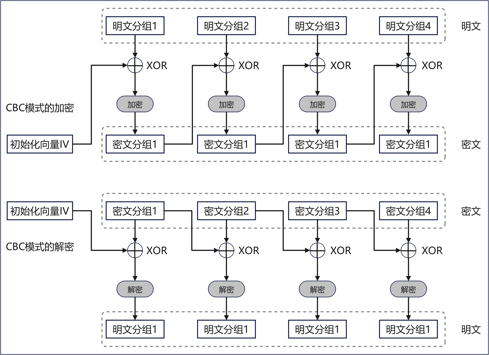

# Blockchain Cryptographic Service Provider (BCCSP)

`bccsp` 包为区块链平台提供了各种密码服务。

## 1 概念介绍

### 1.1 密文分组连接模式(Cipher Block Chaining, CBC)

在 `CBC` 模式中，首先将明文分组与前一个密文分组进行 `XOR` 运算，然后再进行加密。加解密原理如下图所示：



#### 1.1.1 初始化向量(Initialization Vector, IV)

当加密第一个明文分组是，由于不存在“前一个密文分组”，因此需要事先准备一个长度为一个分组的比特序列来替代“前一个密文分组”，这个比特序列称为初始化向量 ，通常缩写为 `IV`。每次加密时都会随机产生一个不同的比特序列来作为初始化向量。

### 1.2 数据填充规则之PKCS7

在数据加解密应用中，数据填充是其中重要的组成部分。数据填充通常有两个作用一是按要求将数据补足到加密算法要求的长度；二是通过增加填充数据来进一步提高密文的安全性。`PKCS7` 是分组对称算法中常用的数据填充规则。

`PKCS7` 的填充方式为当数据长度不足数据块长度时,缺 `x` 位就补 `x` 个 `byte(x)`。对于 `AES128` 算法其数据块为 `16 byte`（待加密的明文长度需要为 `16 byte` 的倍数）,如果数据为 `"00112233445566778899AA"` 一共 `11` 个字节,缺了 `5` 位,采用 `PKCS7` 方式填充之后的数据为 `"00112233445566778899AA0505050505"`。

特别注意的一点是如果是数据刚好满足数据块长度也要在元数据后在按PKCS7规则填充一个数据块数据，这样做的目的是为了区分有效数据和补齐数据。仍以 `AES128` 为例：如果数据为 `"00112233445566778899AABBCCDDEEFF"` 一共 `16` 个自己，采用 `PKCS7` 方式填充之后的数据为 `"00112233445566778899AABBCCDDEEFF10101010101010101010101010101010"`。

### 1.3 PEM 数据编码

`PEM` 格式通常用于数字证书认证机构（Certificate Authorities，CA），扩展名为 `.pem`，`.crt`，`.cer` 和 `.key`。内容为 `Base64` 编码的 `ASCII` 码文件，有类似 `"-----BEGIN CERTIFICATE-----"` 和 `"-----END CERTIFICATE-----"` 的头尾标记。服务器认证证书，中级认证证书和私钥都可以储存为 `PEM` 格式（认证证书其实就是公钥）。`Apache` 和类似的服务器使用 `PEM` 格式证书。

### 1.4 SHA2 和 SHA3

`SHA3` 也称为 `Keccak`，是一种全新的哈希算法，与 `SHA1` 和 `SHA2` 无关。`SHA3` 一开始是一次 `NIST` 竞赛设置的名字，谁能获得第一，设就能将自己的算法名字更改为 `SHA3`。最终，`Keccak` 算法获胜了。`NIST` 之所以选择 `Keccak`，其中一个明确的理由是它与现有的 `SHA1` 和 `SHA2` 算法不一样；有人指出，这种差异性使其可以更好地补充现有的 `SHA2` 算法(`SHA2` 仍被 `NIST` 认为是安全的，并由 `NIST` 推荐)。

### 1.5 ECDSA 签名

`ECDSA` 是 `ECC` 与 `DSA` 的结合，整个签名过程与 `DSA` 类似，所不一样的是签名中采取的算法为 `ECC`，最后签名出来的值也是分为 `r` 和 `s`。

**参数构造**

选择一条椭圆曲线 `E`，基点为 `G`，阶为 `N`。

私钥：`k`；公钥：`K=kG`。

**签名过程**

选择一个随机数 `r (r < N)`，计算点 `R=rG`；将原数据 `m` 和点 `R` 的坐标值 `x,y` 作为参数，计算哈希值 `h = H(m,x,y)`；计算 `s = r - h * k`，将 `r` 和 `s` 作为签名发送给验签者，如果 `r` 和 `s` 其中有一个等于 `0`，则从选择一个随机数 `r` 开始，重新计算签名。

**验签过程**

验签者在收到消息 `m` 和签名 `(r,s)` 后，进行以下运算：

1. 计算点 `R' = rG`，得到点 `R'` 的坐标 `(x',y')`；
2. 验证等式 `sG + H(m,x',y')K = R'` 是否成立，如果等式成立，则签名正确。


## 2 用法

### 2.1 AES 加密

**生成密钥**
```go
key := make([]byte, 32)
rand.Reader.Read(key) // 随机生成一个 32 比特的字节切片，作为 AES 的密钥。
```

**加密**
```go
plaintext := []byte("plain text")
encrypted, err := sw.AESCBCPKCS7Encrypt(key, plaintext)
```

**解密**
```go
decrypted, err := sw.AESCBCPKCS7Decrypt(key, encrypted)
```

## 3 接口介绍

`Key` 接口定义了 `BCCSP` 的密钥功能，该接口的定义如下所示：

```go
type Key interface {
	Bytes() ([]byte, error)
	SKI() []byte
	Symmetric() bool
	Private() bool
	PublicKey() (Key, error)
}
```

接口中每个方法的用处介绍如下：

| 方法名 | 用处 |
|:---:|:---:|
|Bytes() ([]byte, error)|只有可导出的私钥和公钥能调用此方法，如果 AES 密钥是可导出的，那么直接返回密钥本身的值，对于其他公钥，例如 ECDSA 的公钥，则返回公钥的编码值|
|SKI() []byte|返回密钥的标识符，一般是密钥的哈希值，私钥的话，则是返回其公钥的哈希值|
|Symmetric() bool|返回一个布尔值，以表示该密钥是否是对称密钥|
|Private() bool|返回一个布尔值，一表示该密钥是否是私钥|
|PublicKey() (Key, bool)|返回非对称密钥的私钥的公钥，不能对对称密钥调用此方法，不然会报错|